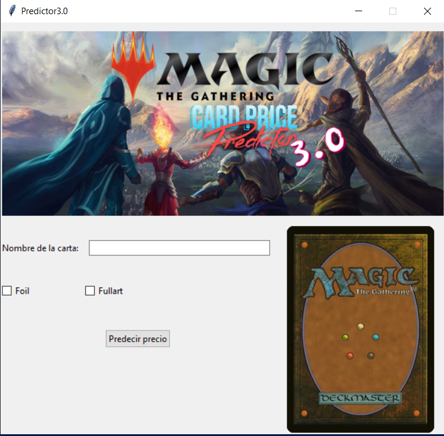

# ML Magic: The Gathering

## Descripción

Este proyecto consiste en el desarrollo y puesta en producción de una aplicación en Python capaz de predecir el precio de una carta de *Magic: The Gathering*, dado su nombre.  
El modelo utiliza técnicas de análisis de texto y aprendizaje automático entrenado sobre datos reales provenientes de la API de Scryfall.



---

## Estructura del proyecto

### `src/`

Directorio principal que contiene todos los archivos fuente del proyecto, incluyendo scripts, modelos, notebooks y recursos.

#### Aplicaciones principales

- `Predictor2.0.py`: versión funcional por consola.
- `Predictor3.0.py`: versión funcional con interfaz gráfica (GUI).

#### `src/data/`

Contiene los datasets en formato `.csv` (bruto y limpio).  
También se almacenan aquí los resultados de métricas y parámetros generados por los modelos.

#### `src/model/`

Carpeta destinada al almacenamiento de los modelos de machine learning entrenados.

- `production/`: contiene el modelo final listo para su uso en producción.

#### `src/pics/`

Imágenes generadas para visualizaciones, análisis o documentación.

- `art/`: recursos gráficos utilizados en la interfaz de la aplicación.

#### `src/notebooks/`

Jupyter Notebooks utilizados durante el desarrollo, análisis y entrenamiento.

- `Dataset_Analisis.ipynb`: exploración inicial del dataset original.
- `Limpieza.ipynb`: limpieza y preparación de datos para el modelado.
- `EDA.ipynb`: análisis exploratorio de los atributos y su relación con el target.
- `Modelado_1-6.ipynb`: distintas iteraciones de entrenamiento y evaluación de modelos.
- `oracle_text_tratamiento.ipynb`: aplicación de técnicas NLP sobre el campo `oracle_text`.
- `Producción_Modelo.ipynb`: preparación y guardado del modelo final en formato `pickle`.

#### `src/Utils/`

Funciones auxiliares y scripts utilizados durante las distintas etapas del proyecto.

- `api_requests.py`: descarga masiva de datos desde la API de Scryfall y conversión a `.csv`.
- `entrenamiento.py`: script experimental enfocado en interpretar el efecto de las cartas mediante NLP.
- `funciones.py`: funciones utilizadas durante la limpieza y transformación de datos.

---

## Requerimientos

### Modulos utilizados:
- requests
- pandas
- numpy
- Pillow
- seaborn
- matplotlib
- scipy
- scikit-learn
- xgboost
- sentence-transformers
- tqdm
```
pip install -r requirements.txt
```
